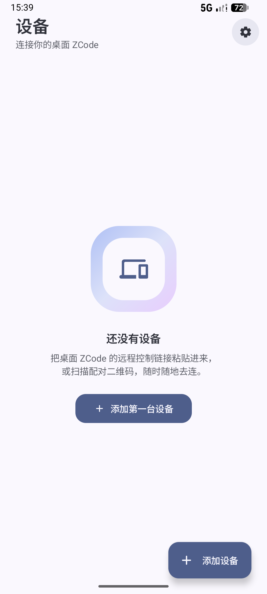
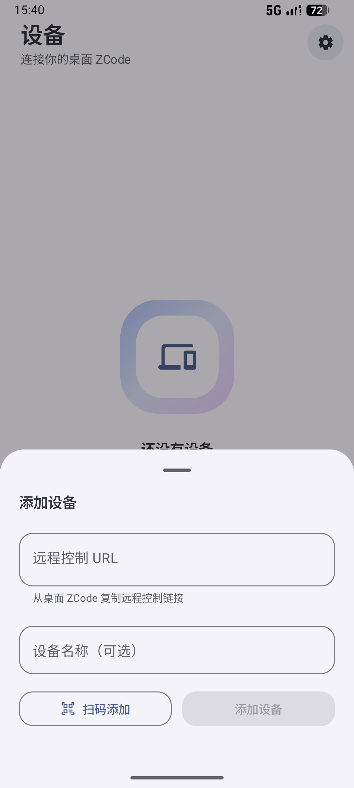
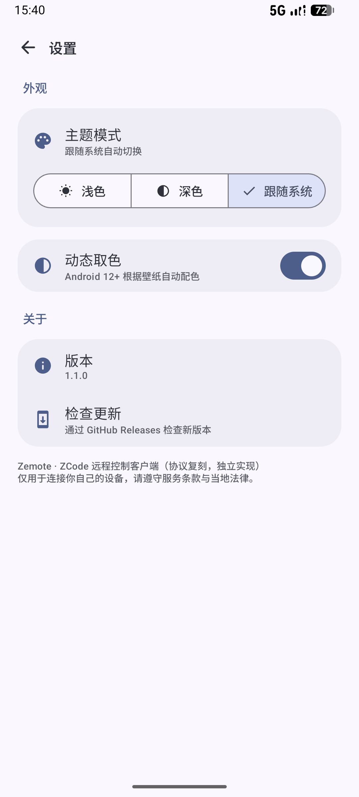
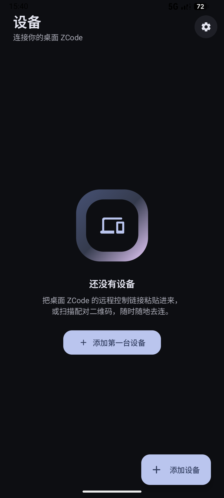

# ZCode-Android (Zemote)

[简体中文](README.md) | English

A native Android client for ZCode remote control. Built by reverse-engineering the
communication protocol of the official web remote-control page, it lets you view and
control desktop ZCode sessions from your phone — no browser needed.

Written in Kotlin with Jetpack Compose (Material 3). All code is an independent
implementation.

📱 **Live preview**: [damianjiang.github.io/ZCode-Android](https://damianjiang.github.io/ZCode-Android)

<p align="center">
  
  
  
  
</p>

## ⚠️ Disclaimer

- This is **not an official client** and has no affiliation with ZCode. The protocol comes
  from packet capture and reverse engineering of the official web page — an official
  update can break it at any time.
- Use it only with your own devices. Follow the ZCode terms of service and local laws.
  You assume all risk.
- The `sid` / `hash` in a remote-control URL are device credentials. Never share them.
  If leaked, regenerate the QR code on the desktop to invalidate them.
- This project collects no data. Credentials are encrypted with Android Keystore
  (AES/GCM) and stored only on your phone.

## ✨ Features

- **Device pairing**: scan the desktop pairing QR code or paste the remote-control URL;
  multiple devices supported with one-tap switching
- **Workspace browsing**: browse directories opened on the desktop, sessions filtered per workspace
- **Session list**: running / history sessions with live updates (sessions-index
  subscription merged with bootstrap)
- **Chat**: **streaming output** — thinking, replies, and tool calls render incrementally
  as they are generated, with inline Markdown rendering and image display
- **Execution activity cards**: consecutive tool calls aggregated into a summary card showing
  which commands ran and which files changed; tap to expand raw output
- **Attachments**: send images and files (chunked upload), received images rendered inline
- **Message queue**: messages sent while the AI is busy are queued — send now, edit, delete,
  and drag-to-reorder
- **Model & thinking level switching**: current model, thinking level, and context usage
  displayed in the session header
- **Auto-follow / manual scroll**: auto-scroll to latest, or disable to browse history freely
- **Scroll to bottom button**: one-tap jump back to the latest message
- **Dark mode**: system follow or manual toggle; supports Android 12+ dynamic color
- **Foreground keep-alive service**: ongoing notification while connected reduces background
  disconnections
- **Subagents**: "View subagent" button inside tool call cards; opens a read-only sub-session
  page, restores parent on back
- **Permission approval**: full support for `permission_request` / `elicitation_request`,
  approve file access or commands directly from your phone
- **Task panel**: real-time view of running background tasks and pending interactions in the
  chat header; cancel tasks with one tap
- **Debug logs**: Settings → Debug → View Logs records all protocol requests/responses and
  user actions; one-tap copy for sharing
- **Cache management**: settings page can clear session bridge cache (disconnects workspaces)
  or debug logs independently
- **Multi-language**: 中文 / English / follow system; all UI strings covered

## 📦 Build

Requires JDK 17 and Android SDK 35.

```bash
git clone https://github.com/Damianjiang/ZCode-Android.git
cd ZCode-Android
./gradlew assembleRelease   # gradlew.bat on Windows
```

The APK is written to `app/build/outputs/apk/release/`. Release builds use R8 and
resource shrinking, signed with the debug key so they install directly. Use
`assembleDebug` for development.

Requires Android 12+ (minSdk 28), arm64-v8a only.

## 🚀 Usage

1. Open remote control in desktop ZCode and generate a pairing link
2. Add a device in the app — paste the link or scan the QR code
3. Once paired, pick a workspace and start chatting

## 📁 Project structure

```
app/src/main/java/app/zemote/
├── MainActivity.kt                  # App entry point
├── ZemoteApp.kt                     # Application class
├── crash/
│   └── CrashHandler.kt              # Crash capture and restart
├── protocol/                        # Protocol stack (fully independent implementation)
│   ├── ConnectionParams.kt          #   URL parsing (sid/hash/t)
│   ├── Proof.kt                     #   HMAC-SHA256 pairing proof
│   ├── IpcCodec.kt                  #   7-bit varint codec
│   ├── RpcFrameTransport.kt         #   rpc-frame fragmentation / CRC32 / reassembly
│   ├── ChannelClient.kt             #   Channel RPC and event subscriptions
│   ├── RelayClient.kt               #   WebSocket connection, heartbeat, reconnect
│   ├── ZemoteClient.kt              #   bootstrap, bridge open and recovery
│   ├── BridgeSession.kt             #   workspace bridge session
│   └── ConversationV4.kt            #   Conversation protocol: subscriptions, streaming,
│                                    #   queue, attachments, permission handling
├── service/
│   └── KeepAliveService.kt          #   Foreground keep-alive notification
├── state/                           # State layer
│   ├── AccountStore.kt              #   Persisted device list
│   ├── AppSessionViewModel.kt       #   Connection and conversation-repo management
│   ├── AppSettings.kt               #   App settings (message count limit, etc.)
│   ├── CredentialCipher.kt          #   Keystore AES/GCM encryption
│   └── LanguagePrefs.kt             #   Language preference
└── ui/                              # Compose UI
    ├── theme/                       #   M3 theme, palettes, typography
    ├── component/                   #   Shared components
    ├── components/                  #   Markdown rendering
    ├── logger/
    │   └── ZemoteLogger.kt          #   Protocol-level debug logging
    ├── navigation/
    │   └── ZemoteNavHost.kt         #   Navigation routes
    └── screens/                     #   Individual screens
        ├── AccountsScreen.kt        #     Device list
        ├── ChatAndTasksScreen.kt    #     Chat page + task panel
        ├── ChangelogScreen.kt       #     In-app changelog
        ├── CrashScreen.kt           #     Crash report viewer
        ├── DeviceSwitchSheet.kt     #     Device switch dialog
        ├── LogScreen.kt             #     Debug log viewer
        ├── MainScreen.kt            #     Bottom navigation shell
        ├── MainShellScreen.kt       #     Post-login main page
        ├── PersonalizeScreen.kt     #     Theme personalization
        ├── QrScanScreen.kt          #     QR code pairing scanner
        └── SettingsScreen.kt        #     Settings page
```

## 📡 Protocol

The stack mirrors the official web client's behavior; the implementation is entirely
independent:

| Layer | Notes |
|---|---|
| Relay | wss connection, 10s heartbeat, exponential-backoff reconnect |
| Pairing | HMAC-SHA256(nonce ‖ role ‖ deviceSid, passHash) |
| IPC | 7-bit varint, type tags (String / Int / JSON / Bytes / Array) |
| RpcFrame | 512KB fragments, CRC32 verification, acks, retransmit on fault |
| Channel RPC | request/response promise + event subscriptions |
| Conversation V4 | snapshot + delta subscriptions, wire-frame reassembly, session queue, attachment upload, permission handling |

Implementation details of the conversation protocol cross-reference the original
Flutter version of this project (same wire behavior).

## 📄 License

MIT. The ZCode name and related trademarks belong to their respective owners; this
project has no affiliation with them.
